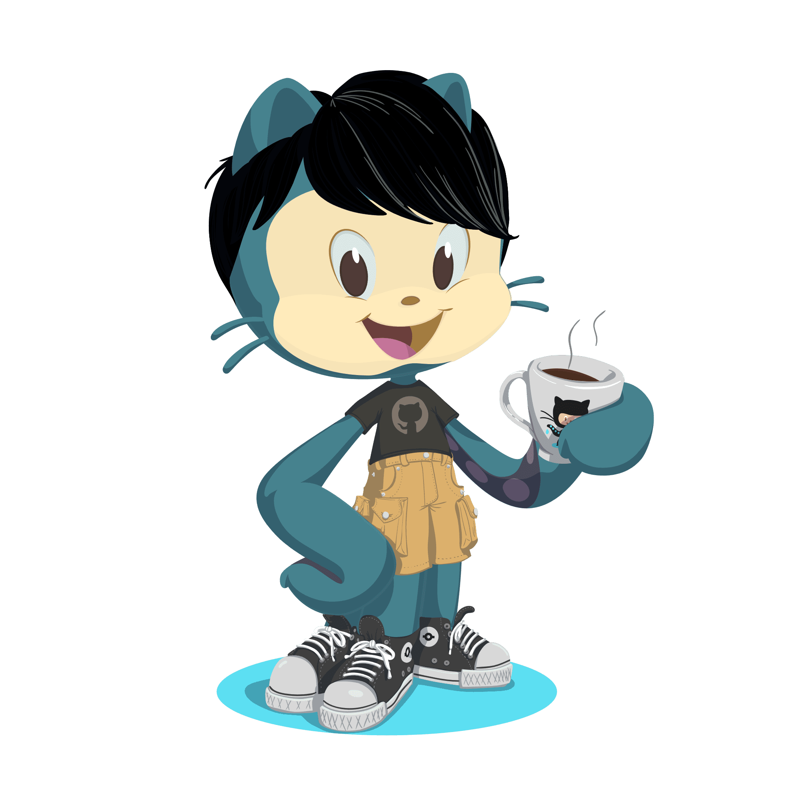

# Hi! 👋 I'm Himanshu
<table>
  <tr>
    <td style="vertical-align: top; padding-right: 20px;">
      I'm a self-proclaimed coding ninja in training at IIITDM Kurnool, AP. Breaking the ice, not the code! 😄
       
       
        - 🌠Computer Science and Engineering student 
        - 💡 Passionate about programming and tech (unless it's a Monday morning bug) 
        - 😄 Love sharing programming jokes (I promise, they're not as buggy as my code) 
        - 🸠Music lover (my code has rhythm too, just a bit offbeat) 
    </td>
    <td width="30%">
      
    </td>
  </tr>
</table>

 

## Skills 🚀
### Programming Languages
  
### Web Development
  
### Tools & More
   

 

## Activities 🤹‍♂️
- 🌌 **Coordinator** at Khagolanveshana, Astronomy Club IIITDM Kurnool, AP.
  - 🌠 Organized star-gazing events and engaged community members (we even found some alien code in the stars!).
- 🎸 **Lead Guitarist** at Roohaniyat, Music Club IIITDM Kurnool, AP.
  - 🎵 Organized musical events and strengthened community bonds (when code meets chords, magic happens!).

 

Feel free to reach out to me via [email](mailto:himanshusinghmahaur.com) or connect on [LinkedIn](https://www.linkedin.com/in/himanshumahaur). Let's discuss tech, share a laugh, or talk about astronomy, music, and, of course, programming mishaps!

Thanks for visiting my GitHub profile! 😂👾
